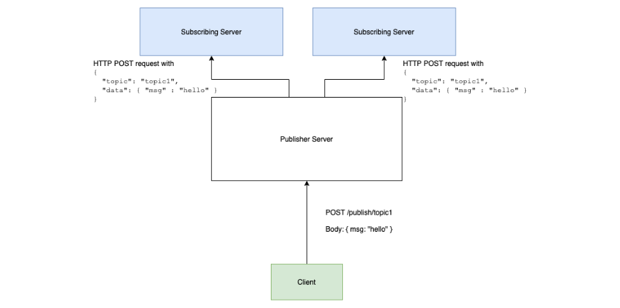

# Pangaea Portal :rocket:

## Description:
This is a simple application that uses laravel notification to send requests to subscribers when a topic is published



### Prerequisites:
You need to have the following software installed on your computer to get the portal up

```
php7.3+
composer
mysql
```
### Installation:
A step by step process of installing the pangae application portal on your local machine manually.

* `git clone https://github.com/JuliRash/pangaea.git`
* `cd pangaea`
* `composer install`
* `cp .env.example .env`
* `php artisan key generate`
* `php artisan migrate`

### Deployment:
* https://laravel.com/docs/5.7/deployment

### Running the application after successful installation.

```$ bash start-server.sh```

or make it executable by running

```$ chmod +x start-server.sh```

```./start-server.sh```

### Alternative installation with docker - [Laravel sail](https://laravel.com/docs/8.x/sail)
Requirements
```
12
```
```$ ./vendor/bin/sail up```

